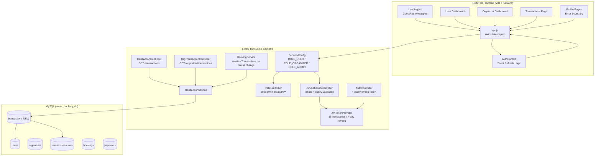
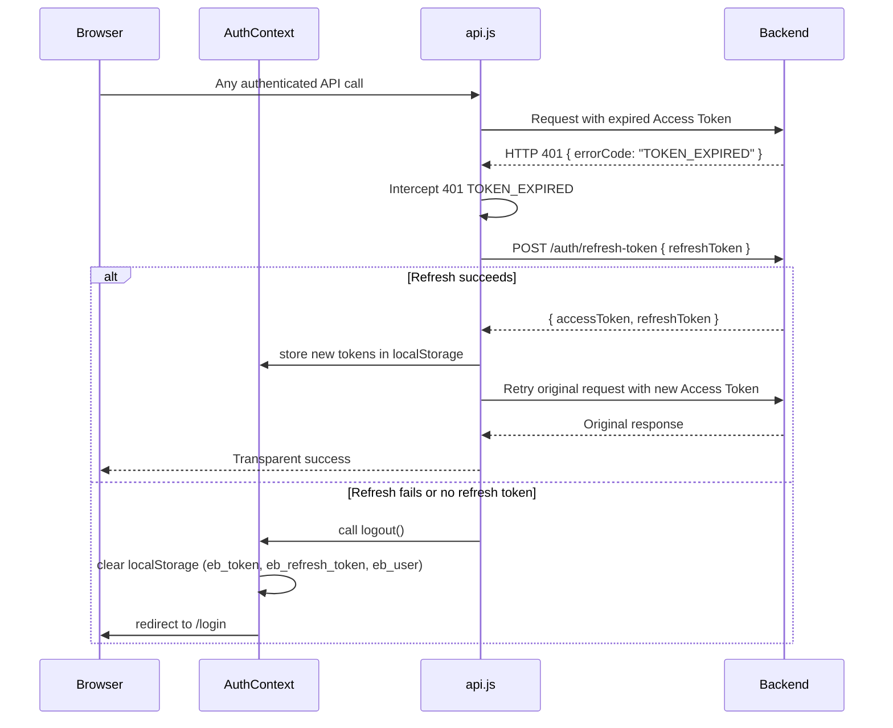
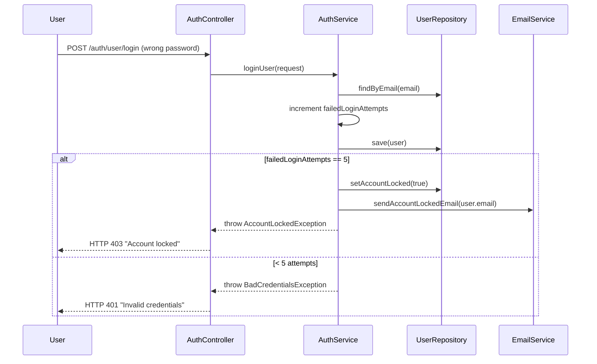
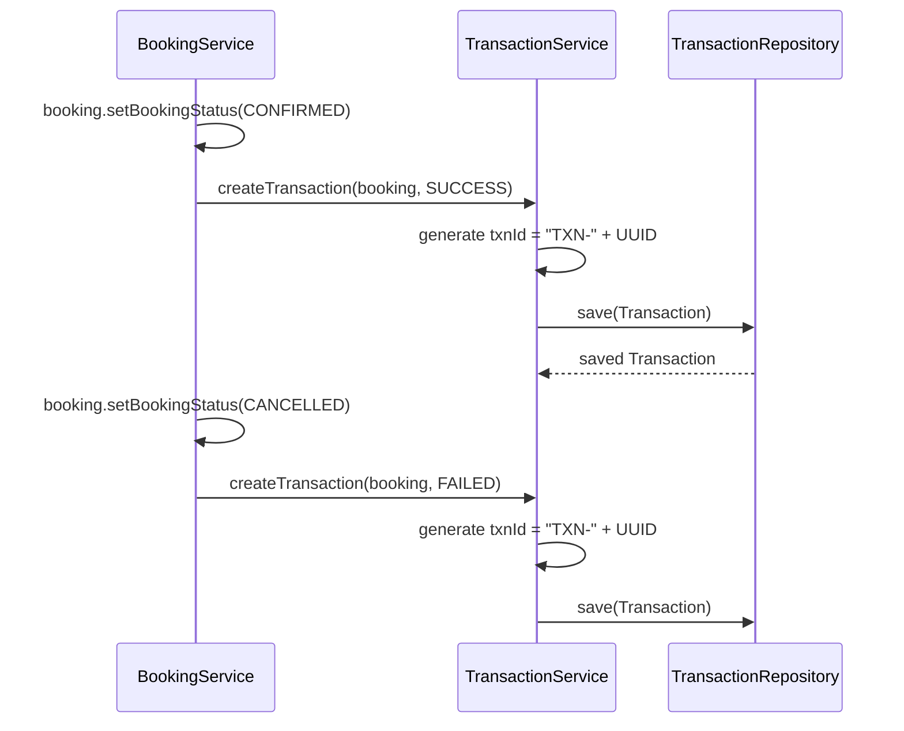

# Design Document: College Event Booking System Upgrade

## Overview

This document describes the technical design for upgrading the existing Spring Boot 3.2.5 + React 18 college event booking system. The upgrade hardens security (JWT rotation, account lockout, rate limiting, issuer validation), introduces a formal ADMIN role, redesigns the landing page with a college-focused theme, adds a Transaction History module, stabilises profile pages, separates USER and ORGANIZER dashboards, extends the database schema, and cleans up frontend code quality.

The existing codebase provides a solid foundation: `JwtTokenProvider` (jjwt 0.12.5), `JwtAuthenticationFilter`, `SecurityConfig` with stateless sessions, React 18 with `AuthContext`, `PrivateRoute`/`GuestRoute` guards, and a Tailwind + Vite frontend. All changes are additive or in-place modifications — no entities are removed, no existing APIs are broken.

---

## Architecture



---

## Sequence Diagrams

### JWT Hardening — Silent Token Refresh Flow



### Account Lockout Flow



### Transaction Creation on Booking State Change



---

## Components and Interfaces

### Backend Components

#### 1. JwtTokenProvider (Modified)

**Purpose**: Issue and validate access tokens (15 min) and refresh tokens (7 days); validate `iss` claim.

**Interface**:
```java
@Component
public class JwtTokenProvider {
    String generateToken(Long id, String email, String role);         // 15-min access token
    String generateRefreshToken(Long id, String email, String role);  // 7-day refresh token
    Claims extractClaims(String token);                               // throws JwtException if invalid/expired
    boolean validateToken(String token);                              // false on any error
    boolean isTokenExpired(String token);                             // true if ExpiredJwtException
    String extractIssuer(String token);                               // reads iss claim
}
```

**Responsibilities**:
- Add `iss` claim = `${jwt.issuer}` (configurable, e.g. `"college-events"`) to every token
- Keep `expirationMs` at 15 minutes (900000 ms) and `refreshExpirationMs` at 7 days (604800000 ms)
- Distinguish `ExpiredJwtException` from other `JwtException` types for accurate error codes

#### 2. JwtAuthenticationFilter (Modified)

**Purpose**: Validate bearer tokens on every request; return structured 401 for expired tokens.

**Interface**:
```java
@Component
public class JwtAuthenticationFilter extends OncePerRequestFilter {
    @Override
    protected void doFilterInternal(HttpServletRequest req, HttpServletResponse res, FilterChain chain);
}
```

**Responsibilities**:
- If token is expired → write JSON response `{ "errorCode": "TOKEN_EXPIRED", "message": "Access token expired", "status": 401 }` and return (do not continue filter chain)
- If token has wrong `iss` claim → return HTTP 401 with `errorCode: "INVALID_ISSUER"`
- On valid token → set `SecurityContextHolder` with `AuthPrincipal(id, email, role)` as before

#### 3. RefreshTokenStore (New)

**Purpose**: Track used refresh tokens to enforce single-use rotation; backed by an in-memory `ConcurrentHashMap` with TTL or a dedicated `refresh_tokens` DB table.

**Interface**:
```java
@Component
public class RefreshTokenStore {
    void markUsed(String tokenJti);     // stores the jti claim as used
    boolean isUsed(String tokenJti);    // true if this token was already redeemed
    void evictExpired();                // @Scheduled hourly cleanup
}
```

**Responsibilities**:
- Persist used token JTIs (add `jti` UUID claim to every refresh token)
- On `POST /auth/refresh-token`, verify the JTI is not already used before issuing new tokens
- Mark the incoming JTI as used immediately after validation

#### 4. AuthController (Modified — add refresh endpoint)

**Purpose**: Expose `POST /auth/refresh-token` for silent token rotation.

**New endpoint**:
```java
@PostMapping("/auth/refresh-token")
ResponseEntity<ApiResponse<AuthResponse>> refreshToken(@RequestBody RefreshTokenRequest request);
```

**Responsibilities**:
- Permit without authentication (`SecurityConfig.permitAll`)
- Validate refresh token signature, expiry, and JTI not-used
- Return new `accessToken` + new `refreshToken` in `AuthResponse`
- Return HTTP 401 if token is invalid, expired, or already used

#### 5. RateLimitFilter (New)

**Purpose**: Cap `/auth/**` requests at 20 per minute per IP.

**Interface**:
```java
@Component
@Order(1)
public class RateLimitFilter extends OncePerRequestFilter {
    @Override
    protected void doFilterInternal(HttpServletRequest req, HttpServletResponse res, FilterChain chain);
    private String resolveClientIp(HttpServletRequest req);
}
```

**Responsibilities**:
- Maintain `ConcurrentHashMap<String, Bucket>` using the Bucket4j or a simple sliding-window counter
- On `/auth/**` requests, check if IP bucket is exhausted → return HTTP 429 with message `"Too many requests"`
- All other paths pass through immediately

#### 6. Transaction Entity + Repository + Service (New)

**Purpose**: Record financial operations linked to bookings.

**Interface**:
```java
@Entity
@Table(name = "transactions")
public class Transaction {
    Long id;
    String txnId;           // TXN-<UUID>, unique, not null
    BigDecimal amount;
    PaymentStatus paymentStatus;  // PENDING, SUCCESS, FAILED
    LocalDateTime paymentDate;
    User user;              // FK → users.id
    Event event;            // FK → events.id
    LocalDateTime createdAt;

    public enum PaymentStatus { PENDING, SUCCESS, FAILED }
}

@Repository
public interface TransactionRepository extends JpaRepository<Transaction, Long> {
    Page<Transaction> findByUserIdOrderByPaymentDateDesc(Long userId, Pageable pageable);
    Page<Transaction> findByEventOrganizerIdOrderByPaymentDateDesc(Long organizerId, Pageable pageable);
}

@Service
public class TransactionService {
    Transaction createTransaction(Booking booking, Transaction.PaymentStatus status);
    Page<TransactionResponse> getUserTransactions(Long userId, Pageable pageable);
    Page<TransactionResponse> getOrganizerTransactions(Long organizerId, Pageable pageable);
}
```

#### 7. TransactionController (New)

**Purpose**: Paginated transaction endpoints for USER and ORGANIZER.

```java
@RestController
public class TransactionController {
    // GET /transactions?page=0&size=10  — ROLE_USER
    @GetMapping("/transactions")
    ResponseEntity<ApiResponse<Page<TransactionResponse>>> getUserTransactions(
        @AuthenticationPrincipal AuthPrincipal principal, Pageable pageable);

    // GET /organizer/transactions?page=0&size=10  — ROLE_ORGANIZER
    @GetMapping("/organizer/transactions")
    ResponseEntity<ApiResponse<Page<TransactionResponse>>> getOrganizerTransactions(
        @AuthenticationPrincipal AuthPrincipal principal, Pageable pageable);
}
```

#### 8. SecurityConfig (Modified)

**Responsibilities**:
- Add `ROLE_ADMIN` documentation (User entity already has `UserRole.ADMIN`)
- Add `POST /auth/refresh-token` to the public permitAll list
- Add security headers: `X-Content-Type-Options: nosniff`, `X-Frame-Options: DENY`
- Set request body size limit of 5 MB via `spring.servlet.multipart.max-request-size=5MB` and a `CommonsRequestLoggingFilter` body-size check
- Register `RateLimitFilter` before `JwtAuthenticationFilter`

#### 9. AuthService (Modified)

**Responsibilities**:
- On login: if `accountLocked == true` → throw `AccountLockedException` (HTTP 423)
- On bad credentials: increment `failedLoginAttempts`; if count reaches 5 → `accountLocked = true` + send lock email; reset counter to 0 on successful login
- Strip whitespace from all string inputs before processing (call `StringUtils.trimWhitespace()`)
- Password reset: validate `resetTokenExpiry.isBefore(LocalDateTime.now())` → HTTP 400 `"Password reset token has expired"`

---

### Frontend Components

#### 1. AuthContext (Modified)

**Purpose**: Add refresh token storage and silent refresh orchestration.

**Interface**:
```javascript
const AuthContext = {
  user,               // parsed user object | null
  loading,            // boolean
  login(authResponse) // stores accessToken → eb_token, refreshToken → eb_refresh_token, user → eb_user
  logout()            // clears all three keys, redirects to /login
  updateUser(updates) // partial update to eb_user
}
```

**Responsibilities**:
- On `login()`: store `refreshToken` under key `eb_refresh_token` in addition to existing keys
- `logout()` must remove `eb_refresh_token` in addition to `eb_token` and `eb_user`

#### 2. api.js Interceptor (Modified)

**Purpose**: Intercept 401 TOKEN_EXPIRED responses and perform silent refresh before retrying.

**Responsibilities**:
- In the response error interceptor, check `err.response.data?.errorCode === 'TOKEN_EXPIRED'`
- If true and not already retrying: call `POST /auth/refresh-token` with `{ refreshToken: localStorage.getItem('eb_refresh_token') }`
- On success: update `eb_token`, `eb_refresh_token`, `api.defaults.headers.common['Authorization']`, and re-run the original failed request
- On refresh failure: call `AuthContext.logout()` and redirect to `/login`
- Use a `_retry` flag on the config to prevent infinite retry loops

#### 3. GuestRoute (Modified)

**Purpose**: Wrap the `/` route to redirect authenticated users away from the landing page.

**Responsibilities**:
- Already wraps `/login`, `/register`, `/forgot-password`, `/reset-password`
- Add to `/` route in `App.jsx`: `<Route path="/" element={<GuestRoute><Wrap><Landing /></Wrap></GuestRoute>} />`
- Redirect logic: `ORGANIZER` → `/organizer/dashboard`, `USER` → `/dashboard`
- While `loading` is true → show `<Spinner full />`
- Add `ADMIN` redirect → `/admin/dashboard` (future-proofing)

#### 4. Landing.jsx (Redesigned)

**Purpose**: College-focused light-theme landing page with search, stats, categories, and featured events.

**Sections**:
- `HeroSection` — headline, subheadline, search form (keyword + collegeName inputs), quick-filter tags (Workshop, Seminar, Cultural, Sports, Technical…)
- `StatsSection` — 4 stat cards (Events Hosted, Students Reached, Colleges, Satisfaction Rate)
- `TwoModeSection` — student card (`/register`) + organizer card (`/register?role=organizer`)
- `CategoriesSection` — 8+ clickable chips, each navigates to `/events?category=<value>`
- `FeaturedEventsSection` — up to 8 upcoming public events from `GET /events?featured=true&size=8`, shows `<Spinner />` while loading
- `CTASection` — "Become an Organizer" button → `/register?role=organizer`

**Color theme** (already matches Navbar):
- Primary: `#1565C0` (blue), Accent: `#D32F2F` (red), Background: `#F0F4FF`

#### 5. TransactionsPage (New — `/transactions`)

**Purpose**: Paginated transaction history for USER role.

**Interface**:
```javascript
// Route: <PrivateRoute roles={['USER']}><Wrap><Transactions /></Wrap></PrivateRoute>
export default function Transactions() {
  const [page, setPage] = useState(0);
  const { data, isLoading } = useQuery(['transactions', page],
    () => transactionsAPI.getUserTransactions({ page, size: 10 }).then(r => r.data.data));
  // renders paginated table: TXN ID | Event Name | Amount | Status | Date
}
```

#### 6. Error Boundary Component (New)

**Purpose**: Catch React render errors in Profile subtrees and display fallback + retry.

```javascript
class ErrorBoundary extends React.Component {
  state = { hasError: false, error: null };
  static getDerivedStateFromError(error) { return { hasError: true, error }; }
  componentDidCatch(error, info) { console.error('ErrorBoundary:', error, info); }
  render() {
    if (this.state.hasError) {
      return (
        <div className="error-fallback">
          <p>{this.state.error?.message || 'Something went wrong'}</p>
          <button onClick={() => { this.setState({ hasError: false }); this.props.onRetry?.(); }}>
            Retry
          </button>
        </div>
      );
    }
    return this.props.children;
  }
}
```

**Usage in Profile pages**:
```jsx
<ErrorBoundary onRetry={refetch}>
  <ProfileContent profile={profile} />
</ErrorBoundary>
```

#### 7. User Dashboard (Modified)

**Sections to add/update**:
- Registered events from `GET /bookings`
- Upcoming events list (filter bookings where event date is in future)
- Transaction history summary: latest 5 from `GET /transactions?page=0&size=5`
- Unread notification count from `GET /notifications/unread` displayed as badge

#### 8. Organizer Dashboard (Modified)

**Sections to add/update**:
- Revenue Summary section: total revenue + recent transactions from `GET /organizer/transactions?page=0&size=5`
- Keep existing 4 metric cards, revenue chart, and events table

---

## Data Models

### New: Transaction Entity

```java
@Entity
@Table(name = "transactions", indexes = {
    @Index(name = "idx_txn_id", columnList = "txn_id", unique = true),
    @Index(name = "idx_txn_user", columnList = "user_id"),
    @Index(name = "idx_txn_event", columnList = "event_id"),
    @Index(name = "idx_txn_status", columnList = "payment_status")
})
@EntityListeners(AuditingEntityListener.class)
@Getter @Setter @NoArgsConstructor @AllArgsConstructor @Builder
public class Transaction {

    @Id
    @GeneratedValue(strategy = GenerationType.IDENTITY)
    private Long id;

    @Column(name = "txn_id", nullable = false, unique = true, length = 60)
    private String txnId;  // format: TXN-<UUID>

    @Column(name = "amount", nullable = false, precision = 10, scale = 2)
    private BigDecimal amount;

    @Enumerated(EnumType.STRING)
    @Column(name = "payment_status", nullable = false, length = 20)
    private PaymentStatus paymentStatus;

    @Column(name = "payment_date")
    private LocalDateTime paymentDate;

    @ManyToOne(fetch = FetchType.LAZY)
    @JoinColumn(name = "user_id", nullable = false)
    private User user;

    @ManyToOne(fetch = FetchType.LAZY)
    @JoinColumn(name = "event_id", nullable = false)
    private Event event;

    @CreatedDate
    @Column(name = "created_at", updatable = false)
    private LocalDateTime createdAt;

    public enum PaymentStatus { PENDING, SUCCESS, FAILED }
}
```

**Validation Rules**:
- `txnId` must match pattern `^TXN-[0-9a-fA-F-]{36}$`
- `amount` must be ≥ 0
- `user` and `event` foreign keys must reference existing rows (cascade delete)

### Modified: Event Entity (new columns)

```java
// Add to existing Event entity:
@Column(name = "college_name", length = 200)
private String collegeName;

@Column(name = "department_name", length = 150)
private String departmentName;

@Column(name = "has_certificate", nullable = false)
@Builder.Default
private boolean hasCertificate = false;

@Column(name = "registration_deadline")
private LocalDate registrationDeadline;
```

### New: RefreshTokenRequest DTO

```java
public record RefreshTokenRequest(@NotBlank String refreshToken) {}
```

### New: TransactionResponse DTO

```java
public record TransactionResponse(
    Long id,
    String txnId,
    String eventName,
    BigDecimal amount,
    String paymentStatus,
    LocalDateTime paymentDate
) {}
```

---

## Database Schema Changes

```sql
-- ─── TRANSACTIONS (NEW) ───────────────────────────────────────────────
CREATE TABLE IF NOT EXISTS transactions (
    id              BIGINT          PRIMARY KEY AUTO_INCREMENT,
    txn_id          VARCHAR(60)     NOT NULL UNIQUE,
    amount          DECIMAL(10,2)   NOT NULL,
    payment_status  VARCHAR(20)     NOT NULL,
    payment_date    DATETIME,
    user_id         BIGINT          NOT NULL,
    event_id        BIGINT          NOT NULL,
    created_at      DATETIME,
    FOREIGN KEY (user_id)  REFERENCES users(id)  ON DELETE CASCADE,
    FOREIGN KEY (event_id) REFERENCES events(id) ON DELETE CASCADE,
    INDEX idx_txn_id     (txn_id),
    INDEX idx_txn_user   (user_id),
    INDEX idx_txn_event  (event_id),
    INDEX idx_txn_status (payment_status)
);

-- ─── EVENTS TABLE — add new columns if not present ────────────────────
ALTER TABLE events
    ADD COLUMN IF NOT EXISTS college_name          VARCHAR(200)  DEFAULT NULL,
    ADD COLUMN IF NOT EXISTS department_name       VARCHAR(150)  DEFAULT NULL,
    ADD COLUMN IF NOT EXISTS has_certificate       BOOLEAN       NOT NULL DEFAULT FALSE,
    ADD COLUMN IF NOT EXISTS registration_deadline DATE          DEFAULT NULL;
```

**JPA DDL strategy**:
- Development: `spring.jpa.hibernate.ddl-auto=update`
- Production: `spring.jpa.hibernate.ddl-auto=validate` (run migrations manually via schema.sql)

---

## API Endpoints Summary

| Method | Path | Auth | Description |
|--------|------|------|-------------|
| `POST` | `/auth/refresh-token` | Public | Token rotation; returns new access + refresh tokens |
| `GET` | `/transactions` | ROLE_USER | Paginated user transaction history |
| `GET` | `/organizer/transactions` | ROLE_ORGANIZER | Paginated organizer revenue transactions |
| `GET` | `/organizer/profile` | ROLE_ORGANIZER | Get organizer profile |
| `PUT` | `/organizer/profile` | ROLE_ORGANIZER | Update organizer profile |
| `GET` | `/organizer/dashboard` | ROLE_ORGANIZER | Dashboard metrics + 30-day analytics |
| `GET` | `/bookings` | ROLE_USER | User bookings (existing) |
| `GET` | `/notifications/unread` | Authenticated | Unread notification count (existing) |

---

## Error Handling

### Error Scenario 1: Expired Access Token

**Condition**: JWT is valid in structure but `exp` claim is in the past.  
**Backend Response**: HTTP 401 `{ "errorCode": "TOKEN_EXPIRED", "status": 401, "message": "Access token expired", "timestamp": "...", "path": "..." }`  
**Frontend Recovery**: Interceptor in `api.js` catches the error code, attempts silent refresh via `POST /auth/refresh-token`, retries the original request. If refresh fails, calls `logout()` and redirects to `/login`.

### Error Scenario 2: Invalid JWT Issuer

**Condition**: Token `iss` claim does not match `${jwt.issuer}` config value.  
**Backend Response**: HTTP 401 `{ "errorCode": "INVALID_ISSUER" }`  
**Frontend Recovery**: Treated as a hard auth failure — `logout()` and redirect to `/login`.

### Error Scenario 3: Account Locked

**Condition**: User reaches 5 consecutive failed login attempts.  
**Backend Response**: HTTP 423 `{ "message": "Your account has been locked due to too many failed attempts. Check your email." }`  
**Frontend Recovery**: Display the error message on the Login form; no retry logic.

### Error Scenario 4: Rate Limit Exceeded

**Condition**: More than 20 requests per minute from the same IP to `/auth/**`.  
**Backend Response**: HTTP 429 `{ "message": "Too many requests. Please try again later." }`  
**Frontend Recovery**: `api.js` shows the toast error message and does not retry.

### Error Scenario 5: Profile Page Crash

**Condition**: Profile API returns an error or network failure occurs during render.  
**Frontend Recovery**: `ErrorBoundary` wrapping profile content catches the error, shows fallback UI with message and "Retry" button that calls `refetch()`.

### Error Scenario 6: Request Body Too Large

**Condition**: Request body exceeds 5 MB.  
**Backend Response**: HTTP 413 `{ "message": "Request body too large" }`  
**Recovery**: Frontend shows toast error; no special handling needed.

---

## Testing Strategy

### Unit Testing Approach

- **`JwtTokenProvider`**: Test that `generateToken` produces tokens that expire at exactly 15 minutes; test `isTokenExpired` distinguishes expired vs. invalid; test `iss` claim is present and matches config.
- **`AuthService`**: Test account lockout at exactly 5 failed attempts; test successful login resets `failedLoginAttempts` to 0; test password reset token expiry check.
- **`TransactionService`**: Test `txnId` format matches `^TXN-[0-9a-fA-F-]{36}$`; test `createTransaction` on CONFIRMED and CANCELLED booking statuses.
- **`RateLimitFilter`**: Test requests 1–20 pass, request 21 returns 429.

### Property-Based Testing Approach

**Property Test Library**: `fast-check` (frontend), `spring-boot-starter-test` + custom generators (backend)

**Frontend properties**:
- For any user object with role `USER`, `GuestRoute` always redirects to `/dashboard`
- For any user object with role `ORGANIZER`, `GuestRoute` always redirects to `/organizer/dashboard`
- For any null/undefined profile fields, `Profile` render never throws (null-safety property)
- `txnId` generation: for any UUID input, the output always matches `TXN-<UUID>` format

**Backend properties**:
- For any valid refresh token not yet used, `POST /auth/refresh-token` always returns HTTP 200 with two new tokens
- For any used refresh token JTI, `POST /auth/refresh-token` always returns HTTP 401
- For any booking status transition to CONFIRMED or CANCELLED, exactly one Transaction record is created

### Integration Testing Approach

- **JWT rotation flow**: login → get access + refresh tokens → wait for 15 min expiry (mock clock) → call protected endpoint → verify 401 TOKEN_EXPIRED → call refresh → verify new tokens → retry succeeds
- **RBAC isolation**: test that a ROLE_USER JWT returns HTTP 403 on all `/organizer/**` paths; test that ROLE_ORGANIZER JWT returns HTTP 403 on all `/admin/**` paths
- **Organizer event isolation**: create two organizers, each with one event; verify organizer A cannot `PUT /events/{organizer_B_event_id}`

---

## Security Considerations

### JWT Hardening
- Access token lifetime reduced from the existing configurable value to **15 minutes** (`jwt.expiration=900000`)
- Refresh token lifetime set to **7 days** (`jwt.refresh-expiration=604800000`)
- Every token includes `iss` claim; the filter rejects tokens where `iss` ≠ configured issuer
- Refresh token rotation: each refresh token carries a `jti` (UUID); the `RefreshTokenStore` records used JTIs to prevent replay attacks

### RBAC
- `SecurityConfig` already restricts `/organizer/**` to `ROLE_ORGANIZER` and `/admin/**` to `ROLE_ADMIN`
- All organizer write operations (`POST /events`, `PUT /events/:id`, `DELETE /events/:id`) must call `EventService.assertOwnership(organizerId, eventId)` which compares `event.organizer.id` with the authenticated principal's ID, throwing a `403` if they differ

### Input Sanitization
- A `@ControllerAdvice` binding advice or a `@ModelAttribute` global handler calls `StringUtils.trimWhitespace()` on all incoming `@RequestBody` string fields before validation
- Alternatively, a custom Jackson deserializer trims strings at deserialization time

### Rate Limiting
- `RateLimitFilter` targets only `/auth/**` to avoid impacting normal API usage
- Uses a simple in-process sliding window (no external Redis required); for production scale, replace with Bucket4j + Redis

### Security Headers
- Added to `SecurityConfig` via Spring Security's `headers()` DSL:
  ```java
  http.headers(h -> h
      .contentTypeOptions(Customizer.withDefaults())   // X-Content-Type-Options: nosniff
      .frameOptions(f -> f.deny())                      // X-Frame-Options: DENY
  );
  ```

### Request Size Limit
- `application.properties`: `spring.servlet.multipart.max-request-size=5MB`, `spring.servlet.multipart.max-file-size=5MB`
- For non-multipart bodies, add `server.tomcat.max-http-form-post-size=5MB`
- The existing `GlobalExceptionHandler` handles `MaxUploadSizeExceededException` → HTTP 413

---

## Performance Considerations

- **Pagination** is mandatory on all list endpoints (`/transactions`, `/organizer/transactions`, `/bookings`, `/organizer/events`). The frontend uses `page`/`size` query params; the backend uses `Pageable`.
- **Lazy loading** on all `@OneToMany` and `@ManyToOne` JPA associations (already the case for `User.bookings`). Transaction joins are fetch-lazy.
- **Index coverage**: The `transactions` table includes indexes on `user_id`, `event_id`, `payment_status`, and the unique `txn_id`. The new `events` columns (`college_name`, `registration_deadline`) are nullable and do not need indexes unless search is added.
- **React Query caching**: All dashboard queries use `react-query` (already in use). Transaction pages should use cache keys like `['transactions', page]` to avoid redundant fetches on pagination.
- **Rate limiter memory**: The in-process `ConcurrentHashMap` for the rate limiter is bounded by the number of unique IPs in the past minute. An `@Scheduled(fixedRate = 60000)` cleanup task evicts expired windows.

---

## Correctness Properties

The following universally quantified properties hold across the entire upgrade. They are derived directly from the acceptance criteria and serve as the basis for property-based and integration tests.

### JWT Token Lifetime Properties

Property 1: For every access token `t` issued by `JwtTokenProvider.generateToken(...)`, the token lifetime is exactly 15 minutes — `exp(t) - iat(t) == 900000 ms`.

**Validates: Requirements 1.1**

Property 2: For every refresh token `rt` issued by `JwtTokenProvider.generateRefreshToken(...)`, the token lifetime is exactly 7 days — `exp(rt) - iat(rt) == 604800000 ms`.

**Validates: Requirements 1.2**

Property 3: For every expired token `t` received by `JwtAuthenticationFilter`, the filter always responds with `HTTP 401` and `errorCode == "TOKEN_EXPIRED"`.

**Validates: Requirements 1.3**

Property 4: For every JWT whose `iss` claim does not equal the configured `${jwt.issuer}` value, the Auth_Filter always rejects it with `HTTP 401` and `errorCode == "INVALID_ISSUER"`.

**Validates: Requirements 9.7**

Property 5: For every refresh token `rt` whose JTI is already present in `RefreshTokenStore` (already used), `POST /auth/refresh-token` always returns `HTTP 401`.

**Validates: Requirements 1.7**

Property 6: For every valid, never-used refresh token `rt`, `POST /auth/refresh-token` always returns `HTTP 200` with a non-null `accessToken`, a non-null `refreshToken`, and `response.refreshToken ≠ rt` (token rotated).

**Validates: Requirements 1.6, 1.7**

### RBAC Properties

Property 7: For every principal `p` where `p.role ≠ ROLE_ADMIN`, every HTTP request to any path matching `/admin/**` always returns `HTTP 403`.

**Validates: Requirements 2.2, 2.5**

Property 8: For every principal `p` where `p.role ≠ ROLE_ORGANIZER`, every HTTP request to any path matching `/organizer/**` always returns `HTTP 403`.

**Validates: Requirements 2.3, 2.4**

Property 9: For every organizer `o` and every event `e` where `e.organizer_id ≠ o.id`, every write operation (PUT/DELETE) by `o` on event `e` always returns `HTTP 403`.

**Validates: Requirements 2.7, 2.8**

### GuestRoute Redirect Properties

Property 10: For every authenticated user `u` with `u.role == "USER"` navigating to `/`, the `GuestRoute` always redirects the browser to `/dashboard`.

**Validates: Requirements 3.1, 3.2**

Property 11: For every authenticated user `u` with `u.role == "ORGANIZER"` navigating to `/`, the `GuestRoute` always redirects the browser to `/organizer/dashboard`.

**Validates: Requirements 3.1, 3.3**

Property 12: For every unauthenticated visitor navigating to `/`, the `GuestRoute` always renders `Landing.jsx` without performing any redirect.

**Validates: Requirements 3.5**

### Transaction Integrity Properties

Property 13: For every string `s` returned as `txnId` from `TransactionService.createTransaction(...)`, `s` always matches the regex `^TXN-[0-9a-fA-F]{8}-[0-9a-fA-F]{4}-[0-9a-fA-F]{4}-[0-9a-fA-F]{4}-[0-9a-fA-F]{12}$`.

**Validates: Requirements 5.2**

Property 14: For every booking `b` whose status transitions to `CONFIRMED`, exactly one `Transaction` with `paymentStatus == SUCCESS` linked to `b.user_id` and `b.event_id` is created within the same transactional boundary.

**Validates: Requirements 5.5**

Property 15: For every booking `b` whose status transitions to `CANCELLED`, exactly one `Transaction` with `paymentStatus == FAILED` linked to `b.user_id` and `b.event_id` is created within the same transactional boundary.

**Validates: Requirements 5.6**

Property 16: For every unauthenticated HTTP request to `GET /transactions`, the response is always `HTTP 401`.

**Validates: Requirements 5.9**

### Security Lockout and Rate-Limiting Properties

Property 17: For every user account `u` and a sequence of exactly 5 consecutive failed login attempts, after the 5th attempt `u.accountLocked == true` and `u.failedLoginAttempts == 5`.

**Validates: Requirements 9.2**

Property 18: For every user account `u` with `k < 5` failed attempts followed by a successful login, after the successful login `u.failedLoginAttempts == 0` and `u.accountLocked == false`.

**Validates: Requirements 9.2**

Property 19: For every IP address sending more than 20 requests within any 60-second window to `/auth/**`, all requests beyond the 20th in that window always return `HTTP 429`.

**Validates: Requirements 9.3**

### Profile Null-Safety Property

Property 20: For every possible `profile` value (including `null`, `undefined`, and partial objects with missing fields) passed as props to `ProfileContent`, the React render never throws a `TypeError` — all field accesses use optional chaining or explicit null guards.

**Validates: Requirements 6.1, 6.3**

---

## Dependencies

### Backend (no new Maven dependencies required)
- `io.jsonwebtoken:jjwt-api:0.12.5` — already present; `jti` claim support is built-in
- `org.springframework.boot:spring-boot-starter-security` — already present; security headers DSL available
- `org.springframework.boot:spring-boot-starter-validation` — already present; used for DTO validation
- `commons-lang3` — already present; `StringUtils.trimWhitespace()` for input sanitisation
- Optional: `com.bucket4j:bucket4j-core` (for production-grade rate limiting) — not required for the in-memory implementation

### Frontend (no new npm packages required)
- `react-query@3.39.3` — already installed; used for all new data-fetching hooks
- `recharts@2.12.7` — already installed; used for revenue chart
- `react-hook-form@7.51.5` + `yup@1.4.0` — already installed; used for CreateEvent/EditEvent forms
- `framer-motion@11.2.10` — already installed; used for page animations
- `react-icons@5.2.1` — already installed; used throughout new components

### Shared CSS Utility Classes (to be defined in `index.css`)

The following classes must be defined and are already referenced across components:

```css
/* Buttons */
.btn-primary   { /* blue filled button */ }
.btn-ghost     { /* transparent with blue text */ }
.btn-outline   { /* bordered button */ }

/* Form */
.input-field   { /* standard text input */ }

/* Badges */
.badge         { /* base badge style */ }
.badge-green   { /* CONFIRMED / PUBLISHED */ }
.badge-red     { /* CANCELLED / FAILED */ }
.badge-yellow  { /* DRAFT / PENDING */ }
.badge-blue    { /* UPCOMING / INFO */ }
.badge-gray    { /* COMPLETED / INACTIVE */ }

/* Layout */
.shadow-card   { /* consistent card shadow */ }
.data-table    { /* full-width table with header styles */ }
.section-title { /* page/section heading typography */ }
```
