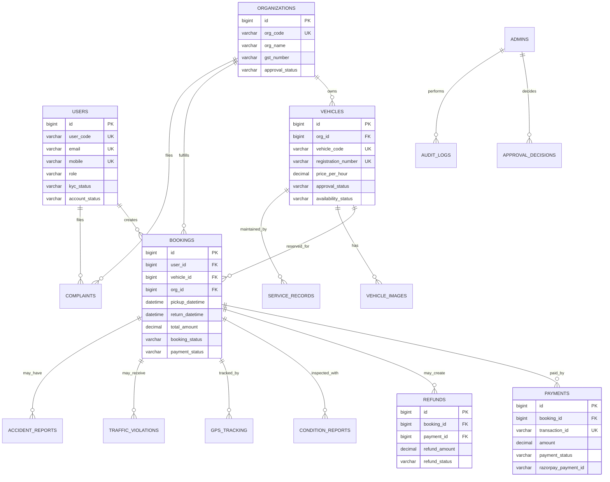

# ER Diagram

```mermaid
erDiagram
  USERS ||--o{ BOOKINGS : creates
  ORGANIZATIONS ||--o{ VEHICLES : owns
  ORGANIZATIONS ||--o{ BOOKINGS : fulfills
  VEHICLES ||--o{ BOOKINGS : reserved_for
  VEHICLES ||--o{ VEHICLE_IMAGES : has
  VEHICLES ||--o{ SERVICE_RECORDS : maintained_by
  BOOKINGS ||--o{ PAYMENTS : paid_by
  BOOKINGS ||--o{ REFUNDS : may_create
  BOOKINGS ||--o{ CONDITION_REPORTS : inspected_with
  BOOKINGS ||--o{ GPS_TRACKING : tracked_by
  BOOKINGS ||--o{ TRAFFIC_VIOLATIONS : may_receive
  BOOKINGS ||--o{ ACCIDENT_REPORTS : may_have
  USERS ||--o{ COMPLAINTS : files
  ORGANIZATIONS ||--o{ COMPLAINTS : files
  ADMINS ||--o{ APPROVAL_DECISIONS : decides
  ADMINS ||--o{ AUDIT_LOGS : performs

  USERS {
    bigint id PK
    varchar user_code UK
    varchar email UK
    varchar mobile UK
    varchar role
    varchar kyc_status
    varchar account_status
  }

  ORGANIZATIONS {
    bigint id PK
    varchar org_code UK
    varchar org_name
    varchar gst_number
    varchar approval_status
  }

  VEHICLES {
    bigint id PK
    bigint org_id FK
    varchar vehicle_code UK
    varchar registration_number UK
    decimal price_per_hour
    varchar approval_status
    varchar availability_status
  }

  BOOKINGS {
    bigint id PK
    bigint user_id FK
    bigint vehicle_id FK
    bigint org_id FK
    datetime pickup_datetime
    datetime return_datetime
    decimal total_amount
    varchar booking_status
    varchar payment_status
  }

  PAYMENTS {
    bigint id PK
    bigint booking_id FK
    varchar transaction_id UK
    decimal amount
    varchar payment_status
    varchar razorpay_payment_id
  }

  REFUNDS {
    bigint id PK
    bigint booking_id FK
    bigint payment_id FK
    decimal refund_amount
    varchar refund_status
  }
```

